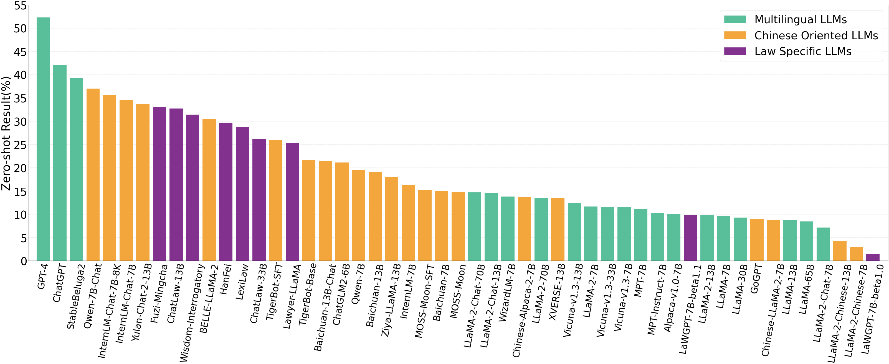
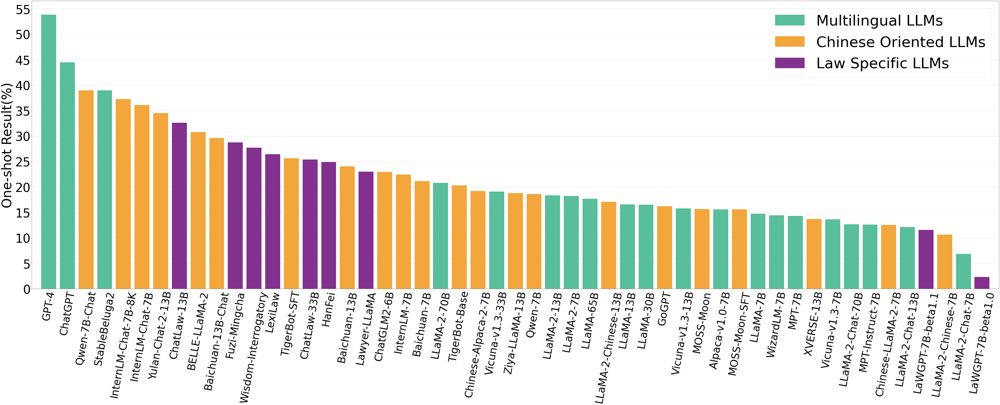

<div align = center>
    
</div>
<h1 align="center">Benchmarking Legal Knowledge of Large Language Models</h1> </center>
<p align="center">
   🌐 <a href="https://lawbench.opencompass.org.cn/home" target="_blank">Website</a> • 🤗 <a href="https://huggingface.co/opencompass" target="_blank">Hugging Face</a> • ⏬ <a href="https://github.com/open-compass/LawBench/tree/main/data" target="_blank">Data</a> •   📃 <a href="https://arxiv.org/abs/2309.16289" target="_blank">Paper</a> 
</p>

<p align="center">
    📖 <a href="https://github.com/open-compass/LawBench/blob/main/README.md">   中文</a> | <a href="https://github.com/open-compass/LawBench/blob/main/README_EN.md">English</a>
</p>
大语言模型（LLMs）在各个方面都展现出了其强大的能力。然而，当将它们应用于高度专业化、安全关键的法律领域时，它们究竟掌握了多少法律知识以及它们是否能可靠地执行法律相关任务我们却不得而知。为了填补这一空白，我们提出了一个综合评估基准<b>LawBench</b>。更多详情可查看我们的<a href="https://arxiv.org/abs/2309.16289" target="_blank">论文</a>。

<b>LawBench中的任务基于中国的法律体系。基于美国法律体系的类似基准可参见<a href="https://github.com/HazyResearch/legalbench">链接</a>。</b>

## ✨ 介绍
LawBench经过精心设计，可对大语言模型的法律能力进行精确评估。
在设计测试任务时，我们模拟了司法认知的三个维度，并选择了20个任务来评估大模型的能力。与一些仅有多项选择题的现有基准相比，我们包含了更多与现实世界应用密切相关的任务类型，如法律实体识别、阅读理解、犯罪金额计算和咨询等。
我们认识到当前大模型的安全性策略可能会拒绝回应某些法律询问，或在理解指令方面遇到困难，从而导致缺乏回应。因此，我们开发了一个单独的评估指标 "弃权率"，以衡量模型拒绝提供答案或未能正确理解指令的频率。
我们汇报了51种大语言模型在LawBench上的表现，包括20种多语言模型、22种中文模型和9种法律专用大语言模型。

## 📖 数据集
我们的数据集包括 20 个不同的任务，涵盖 3 个认知水平：
- **法律知识记忆**：大语言模型能否记住必要的法律概念、术语、法条和事实。
- **法律知识理解**：大语言模型能否理解法律文本中的实体、事件和关系，从而理解法律文本的意义和内涵。
- **法律知识应用**：大语言模型能否正确利用其法律知识、对其进行推理从而解决下游应用中的现实法律任务。

任务列表

以下是包含的任务列表。每项任务都有 500 个示例。

<table class="tg">
<thead>
  <tr>
    <th class="tg-0pky">认知水平</th>
    <th class="tg-0pky">ID</th>
    <th class="tg-0pky">任务</th>
    <th class="tg-0pky">数据源</th>
    <th class="tg-0pky">指标</th>
     <th class="tg-0pky">类型</th>
  </tr>
</thead>
<tbody>
  <tr>
    <td class="tg-lboi" rowspan="2"><b>法律知识记忆</b></td>
    <td class="tg-qdov">1-1</td>
    <td class="tg-qdov">法条背诵</td>
    <td class="tg-qdov"><a href="https://flk.npc.gov.cn/">FLK</a></td>
    <td class="tg-qdov">ROUGE-L</td>
    <td class="tg-qdov">生成</td>
  </tr>
  <tr>
    <td class="tg-0pky">1-2</td>
    <td class="tg-qdov">知识问答</td>
    <td class="tg-0pky"><a href="https://jecqa.thunlp.org/">JEC_QA</a></td>
    <td class="tg-0pky">Accuracy</td>
   <td class="tg-0pky">单选</td>
  </tr>
  <tr>
    <td class="tg-lboi" rowspan="10"><b>法律知识理解</b></td>
    <td class="tg-0pky">2-1</td>
    <td class="tg-0pky">文件校对</td>
    <td class="tg-0pky"><a href="http://cail.cipsc.org.cn/task_summit.html?raceID=2&cail_tag=2022">CAIL2022</a></td>
    <td class="tg-0pky">F0.5</td>
     <td class="tg-0pky">生成</td>
  </tr>
  <tr>
    <td class="tg-0pky">2-2</td>
    <td class="tg-0pky">纠纷焦点识别</td>
    <td class="tg-0pky"><a href="https://laic.cjbdi.com/">LAIC2021</a></td>
    <td class="tg-0pky">F1</td>
     <td class="tg-0pky">多选</td>
  </tr>
  <tr>
    <td class="tg-0pky">2-3</td>
    <td class="tg-0pky">婚姻纠纷鉴定</td>
    <td class="tg-0pky"><a href="https://aistudio.baidu.com/datasetdetail/181754">AIStudio</a></td>
    <td class="tg-0pky">F1</td>
     <td class="tg-0pky">多选</td>
  </tr>
  <tr>
    <td class="tg-0pky">2-4</td>
    <td class="tg-0pky">问题主题识别</td>
    <td class="tg-0pky"><a href="https://github.com/liuhuanyong/CrimeKgAssitant">CrimeKgAssitant</a></td>
    <td class="tg-0pky">Accuracy</td>
     <td class="tg-0pky">单选</td>
  </tr>
  <tr>
    <td class="tg-0pky">2-5</td>
    <td class="tg-0pky">阅读理解</td>
    <td class="tg-0pky"><a href="http://cail.cipsc.org.cn/task_summit.html?raceID=1&cail_tag=2019">CAIL2019</a></td>
    <td class="tg-0pky">rc-F1</td>
     <td class="tg-0pky">抽取</td>
  </tr>
  <tr>
    <td class="tg-0pky">2-6</td>
    <td class="tg-0pky">命名实体识别</td>
    <td class="tg-0pky"><a href="https://github.com/china-ai-law-challenge/CAIL2021/tree/main/xxcq">CAIL2021</a></td>
    <td class="tg-0pky">soft-F1</td>
     <td class="tg-0pky">抽取</td>
  </tr>
  <tr>
    <td class="tg-0pky">2-7</td>
    <td class="tg-0pky">舆情摘要</td>
    <td class="tg-0pky"><a href="http://cail.cipsc.org.cn/task_summit.html?raceID=4&cail_tag=2022">CAIL2022</a></td>
    <td class="tg-0pky">ROUGE-L</td>
     <td class="tg-0pky">生成</td>
  </tr>
  <tr>
    <td class="tg-0pky">2-8</td>
    <td class="tg-qdov">论点挖掘</td>
      <td class="tg-0pky"><a href="http://cail.cipsc.org.cn/task_summit.html?raceID=5&cail_tag=2022">CAIL2022</a></td>
    <td class="tg-0pky">Accuracy</td>
     <td class="tg-0pky">单选</td>
  </tr>
  <tr>
    <td class="tg-0pky">2-9</td>
    <td class="tg-qdov">事件检测</td>
    <td class="tg-0pky"><a href="https://github.com/thunlp/LEVEN">LEVEN</a></td>
    <td class="tg-0pky">F1</td>
     <td class="tg-0pky">多选</td>
  </tr>
  <tr>
    <td class="tg-0pky">2-10</td>
    <td class="tg-qdov">触发词提取</td>
    <td class="tg-0pky"><a href="https://github.com/thunlp/LEVEN">LEVEN</a></td>
    <td class="tg-0pky">soft-F1</td>
     <td class="tg-0pky">抽取</td>
  </tr>
  <tr>
    <td class="tg-lboi" rowspan="8"><b>法律知识应用</b></td>
    <td class="tg-0pky">3-1</td>
    <td class="tg-0pky">法条预测(基于事实)</td>
    <td class="tg-0pky"><a href="https://github.com/china-ai-law-challenge/cail2018">CAIL2018</a></td>
    <td class="tg-0pky">F1</td>
     <td class="tg-0pky">多选</td>
  </tr>
  <tr>
    <td class="tg-0pky">3-2</td>
    <td class="tg-0pky">法条预测(基于场景)</td>
    <td class="tg-0pky"><a href="https://github.com/LiuHC0428/LAW-GPT">LawGPT_zh Project</a></td>
    <td class="tg-0pky">ROUGE-L</td>
     <td class="tg-0pky">生成</td>
  </tr>
  <tr>
    <td class="tg-0pky">3-3</td>
    <td class="tg-0pky">罪名预测</td>
    <td class="tg-0pky"><a href="https://github.com/china-ai-law-challenge/cail2018">CAIL2018</a></td>
    <td class="tg-0pky">F1</td>
      <td class="tg-0pky">多选</td>
  </tr>
  <tr>
    <td class="tg-0pky">3-4</td>
    <td class="tg-0pky">刑期预测(无法条内容)</td>
    <td class="tg-0pky"><a href="https://github.com/china-ai-law-challenge/cail2018">CAIL2018</a></td>
    <td class="tg-0pky">Normalized log-distance</td>
     <td class="tg-0pky">回归</td>
  </tr>
  <tr>
    <td class="tg-0pky">3-5</td>
    <td class="tg-0pky">刑期预测(给定法条内容)</td>
    <td class="tg-0pky"><a href="https://github.com/china-ai-law-challenge/cail2018">CAIL2018</a></td>
    <td class="tg-0pky">Normalized log-distance</td>
     <td class="tg-0pky">回归</td>
  </tr>
  <tr>
    <td class="tg-0lax">3-6</td>
    <td class="tg-0lax">案例分析</td>
      <td class="tg-0lax"><a href="https://jecqa.thunlp.org/">JEC_QA</a></td>
    <td class="tg-0lax">Accuracy</td>
     <td class="tg-0lax">单选</td>
  </tr>
  <tr>
    <td class="tg-0lax">3-7</td>
    <td class="tg-0lax">犯罪金额计算</td>
      <td class="tg-0lax"><a href="https://laic.cjbdi.com/">LAIC2021</a></td>
    <td class="tg-0lax">Accuracy</td>
     <td class="tg-0lax">回归</td>
  </tr>
  <tr>
    <td class="tg-0lax">3-8</td>
    <td class="tg-0lax">咨询</td>
    <td class="tg-0lax"><a href="https://www.66law.cn/">hualv.com</a></td>
    <td class="tg-0lax">ROUGE-L</td>
     <td class="tg-0lax">生成</td>
  </tr>
</tbody>
</table>

### 数据格式
数据存储在 [data](https://github.com/open-compass/LawBench/tree/main/data)  文件夹下。每个任务都存储在 <task_id>.json 文件中。
可以通过 json.load 将 json 文件作为字典列表加载。
数据格式如下（以任务 3-2 为例）：

```json
[
  {
    "instruction": "请根据具体场景与问题给出法律依据，只需要给出具体法条内容，每个场景仅涉及一个法条。",
    "question": "场景:某个地区的三个以上专业农民合作社想要出资设立农民专业合作社联合社，以提高其在市场中的竞争力和规模效应。根据哪条法律，三个以上的农民专业合作社可以出资设立农民专业合作社联合社？",
    "answer": "根据《农民专业合作社法》第五十六条，三个以上的农民专业合作社在自愿的基础上，可以出资设立农民专业合作社联合社。该联合社应当有自己的名称、组织机构和住所，由联合社全体成员制定并承认的章程，以及符合章程规定的成员出资。"
  },
]
```

### 模型输出格式
模型输出存储在 [predictions/zero_shot](https://github.com/open-compass/LawBench/tree/main/predictions/zero_shot) 和 [predictions/one_shot](https://github.com/open-compass/LawBench/tree/main/predictions/one_shot)  文件夹下。每个系统都有自己的子文件夹。在每个子文件夹中，任务预测都存储在 <task_id>.json 文件中。
可以通过 json.load 将 json 文件作为字典加载。
数据格式如下（以 GPT-4 零样本预测中的任务 3-2 为例）：

```json
{
    "0": {
        "origin_prompt": [
            {
                "role": "HUMAN",
                "prompt": "请根据具体场景与问题给出法律依据，只需要给出具体法条内容，每个场景仅涉及一个法条。\n场景:某个地区的三个以上专业农民合作社想要出资设立农民专业合作社联合社，以提高其在市场中的竞争力和规模效应。根据哪条法律，三个以上的农民专业合作社可以出资设立农民专业合作社联合社？"
            }
        ],
        "prediction": "根据《中华人民共和国农民专业合作社法》第十七条：“三个以上的农民专业合作社可以出资设立农民专业合作社联合社。”",
        "refr": "根据《农民专业合作社法》第五十六条，三个以上的农民专业合作社在自愿的基础上，可以出资设立农民专业合作社联合社。该联合社应当有自己的名称、组织机构和住所，由联合社全体成员制定并承认的章程，以及符合章程规定的成员出资。"
    },
```

## 📖 模型列表
我们测试了 51 种热门的大语言模型。我们对它们进行了分组，如下表所示：
<table class="tg">
<thead>
  <tr>
    <th class="tg-0pky">Model</th>
    <th class="tg-0pky">Parameters</th>
    <th class="tg-0pky">SFT</th>
    <th class="tg-0pky">RLHF</th>
    <th class="tg-0lax">Access</th>
    <th class="tg-0lax">Base Model</th>
  </tr>
</thead>
<tbody>
  <tr>
    <td class="tg-9wq8" colspan="8"><b>Multilingual LLMs</b></td>
  </tr>
  <tr>
    <td class="tg-za14">MPT</td>
    <td class="tg-za14">7B</td>
    <td class="tg-0pky">&#10007</td>
    <td class="tg-0pky">&#10007</td>
    <td class="tg-0lax">Weights</td>
    <td class="tg-0lax">-</td>
  </tr>
  <tr>
    <td class="tg-za14">MPT-Instruct</td>
    <td class="tg-za14">7B</td>
    <td class="tg-0pky">&#10003</td>
    <td class="tg-0pky">&#10007</td>
    <td class="tg-0lax">Weights</td>
    <td class="tg-0lax">MPT-7B</td>
  </tr>
  <tr>
    <td class="tg-za14">LLaMA</td>
    <td class="tg-za14">7/13/30/65B</td>
    <td class="tg-0pky">&#10007</td>
    <td class="tg-0pky">&#10007</td>
    <td class="tg-0lax">Weights</td>
    <td class="tg-0lax">-</td>
  </tr>
  <tr>
    <td class="tg-za14">LLaMA-2</td>
    <td class="tg-za14">7/13/70B</td>
    <td class="tg-0pky">&#10007</td>
    <td class="tg-0pky">&#10007</td>
    <td class="tg-0lax">Weights</td>
    <td class="tg-0lax">-</td>
  </tr>
  <tr>
    <td class="tg-za14">LLaMA-2-Chat</td>
    <td class="tg-za14">7/13/70B</td>
    <td class="tg-0pky">&#10003</td>
    <td class="tg-0pky">&#10003</td>
    <td class="tg-0lax">Weights</td>
    <td class="tg-0lax">LLaMA-2-7/13/70B</td>
  </tr>
  <tr>
    <td class="tg-0pky">Alpaca-v1.0</td>
    <td class="tg-0pky">7B</td>
    <td class="tg-0pky">&#10003</td>
    <td class="tg-0pky">&#10007</td>
    <td class="tg-0lax">Weights</td>
    <td class="tg-0lax">LLaMA-7B</td>
  </tr>
  <tr>
    <td class="tg-za14">Vicuna-v1.3</td>
    <td class="tg-za14">7/13/33B</td>
    <td class="tg-0pky">&#10003</td>
    <td class="tg-0pky">&#10007</td>
    <td class="tg-0lax">Weights</td>
    <td class="tg-0lax">LLaMA-7/13/33B</td>
  </tr>
  <tr>
    <td class="tg-za14">WizardLM</td>
    <td class="tg-za14">7B</td>
    <td class="tg-0pky">&#10003</td>
    <td class="tg-0pky">&#10007</td>
    <td class="tg-0lax">Weights</td>
    <td class="tg-0lax">LLaMA-7B</td>
  </tr>
  <tr>
    <td class="tg-za14">StableBeluga2</td>
    <td class="tg-za14">70B</td>
    <td class="tg-0pky">&#10003</td>
    <td class="tg-0pky">&#10007</td>
    <td class="tg-0lax">Weights</td>
    <td class="tg-0lax">LLaMA-2-70B</td>
  </tr>
  <tr>
    <td class="tg-za14">ChatGPT</td>
    <td class="tg-za14">N/A</td>
    <td class="tg-0pky">&#10003</td>
    <td class="tg-0pky">&#10003</td>
    <td class="tg-0lax">API</td>
    <td class="tg-0lax">-</td>
  </tr>
  <tr>
    <td class="tg-za14">GPT-4</td>
    <td class="tg-za14">N/A</td>
    <td class="tg-0pky">&#10003</td>
    <td class="tg-0pky">&#10003</td>
    <td class="tg-0lax">API</td>
    <td class="tg-0lax">-</td>
  </tr>
  <tr>
    <td class="tg-9wq8" colspan="8"><b>Chinese-oriented LLMs</b></td>
  </tr>
  <tr>
    <td class="tg-7zrl">MOSS-Moon</td>
    <td class="tg-7zrl">16B</td>
    <td class="tg-0lax">&#10007</td>
    <td class="tg-0lax">&#10007</td>
    <td class="tg-0lax">Weights</td>
    <td class="tg-7zrl">-</td>
  </tr>
  <tr>
    <td class="tg-7zrl">MOSS-Moon-SFT</td>
    <td class="tg-7zrl">16B</td>
    <td class="tg-0lax">&#10003</td>
    <td class="tg-0lax">&#10007</td>
    <td class="tg-0lax">Weights</td>
    <td class="tg-7zrl">MOSS-Moon</td>
  </tr>
  <tr>
    <td class="tg-0lax">TigerBot-Base</td>
    <td class="tg-0lax">7B</td>
    <td class="tg-0lax">&#10007</td>
    <td class="tg-0lax">&#10007</td>
    <td class="tg-0lax">Weights</td>
    <td class="tg-0lax">-</td>
  </tr>
  <tr>
    <td class="tg-0lax">TigerBot-SFT</td>
    <td class="tg-hx86">7B</td>
    <td class="tg-0lax">&#10003</td>
    <td class="tg-0lax">&#10007</td>
    <td class="tg-0lax">Weights</td>
    <td class="tg-0lax">TigerBot-Base</td>
  </tr>
  <tr>
    <td class="tg-7zrl">GoGPT</td>
    <td class="tg-7zrl">7B</td>
    <td class="tg-0lax">&#10003</td>
    <td class="tg-0lax">&#10007</td>
    <td class="tg-0lax">Weights</td>
    <td class="tg-0lax">LLaMA-7B</td>
  </tr>
  <tr>
    <td class="tg-7zrl">ChatGLM2</td>
    <td class="tg-7zrl">6B</td>
    <td class="tg-0lax">&#10003</td>
    <td class="tg-0lax">&#10007</td>
    <td class="tg-0lax">Weights</td>
    <td class="tg-7zrl">ChatGLM</td>
  </tr>
  <tr>
    <td class="tg-za14">Ziya-LLaMA</td>
    <td class="tg-za14">13B</td>
    <td class="tg-0pky">&#10003</td>
    <td class="tg-0pky">&#10003</td>
    <td class="tg-0lax">Weights</td>
    <td class="tg-0lax">LLaMA-13B</td>
  </tr>
  <tr>
    <td class="tg-7zrl">Baichuan</td>
    <td class="tg-7zrl">7/13B</td>
    <td class="tg-0lax">&#10007</td>
    <td class="tg-0lax">&#10007</td>
    <td class="tg-0lax">Weights</td>
    <td class="tg-7zrl">-</td>
  </tr>
  <tr>
    <td class="tg-7zrl">Baichuan-13B-Chat</td>
    <td class="tg-7zrl">13B</td>
    <td class="tg-0lax">&#10003</td>
    <td class="tg-0lax">&#10007</td>
    <td class="tg-0lax">Weights</td>
    <td class="tg-7zrl">Baichuan-13B</td>
  </tr>
  <tr>
    <td class="tg-7zrl">XVERSE</td>
    <td class="tg-7zrl">13B</td>
    <td class="tg-0lax">&#10007</td>
    <td class="tg-0lax">&#10007</td>
    <td class="tg-0lax">Weights</td>
    <td class="tg-7zrl">-</td>
  </tr>
  <tr>
    <td class="tg-7zrl">InternLM</td>
    <td class="tg-7zrl">7B</td>
    <td class="tg-0lax">&#10007</td>
    <td class="tg-0lax">&#10007</td>
    <td class="tg-0lax">Weights</td>
    <td class="tg-7zrl">-</td>
  </tr>
  <tr>
    <td class="tg-7zrl">InternLM-Chat</td>
    <td class="tg-7zrl">7B</td>
    <td class="tg-0lax">&#10003</td>
    <td class="tg-0lax">&#10007</td>
    <td class="tg-0lax">Weights</td>
    <td class="tg-7zrl">InternLM-7B</td>
  </tr>
  <tr>
    <td class="tg-7zrl">InternLM-Chat-7B-8K</td>
    <td class="tg-7zrl">7B</td>
    <td class="tg-0lax">&#10003</td>
    <td class="tg-0lax">&#10007</td>
    <td class="tg-0lax">Weights</td>
    <td class="tg-7zrl">InternLM-7B</td>
  </tr>
  <tr>
    <td class="tg-7zrl">Qwen</td>
    <td class="tg-7zrl">7B</td>
    <td class="tg-0lax">&#10007</td>
    <td class="tg-0lax">&#10007</td>
    <td class="tg-0lax">Weights</td>
    <td class="tg-7zrl">-</td>
  </tr>
  <tr>
    <td class="tg-7zrl">Qwen-7B-Chat</td>
    <td class="tg-7zrl">7B</td>
    <td class="tg-0lax">&#10003</td>
    <td class="tg-0lax">&#10007</td>
    <td class="tg-0lax">Weights</td>
    <td class="tg-7zrl">Qwen-7B</td>
  </tr>
  <tr>
    <td class="tg-7zrl">Yulan-Chat-2</td>
    <td class="tg-7zrl">13B</td>
    <td class="tg-0lax">&#10003</td>
    <td class="tg-0lax">&#10007</td>
    <td class="tg-0lax">Weights</td>
    <td class="tg-7zrl">LLaMA-2-13B</td>
  </tr>
  <tr>
    <td class="tg-za14">BELLE-LLaMA-2</td>
    <td class="tg-za14">13B</td>
    <td class="tg-0pky">&#10003</td>
    <td class="tg-0pky">&#10007</td>
    <td class="tg-0lax">Weights</td>
    <td class="tg-0lax">LLaMA-2-13B</td>
  </tr>
  <tr>
    <td class="tg-7zrl">Chinese-LLaMA-2</td>
    <td class="tg-7zrl">7B</td>
    <td class="tg-0lax">&#10003</td>
    <td class="tg-0lax">&#10007</td>
    <td class="tg-0lax">Weights</td>
    <td class="tg-0lax">LLaMA-2-7B</td>
  </tr>
  <tr>
    <td class="tg-za14">Chinese-Alpaca-2</td>
    <td class="tg-za14">7B</td>
    <td class="tg-0pky">&#10003</td>
    <td class="tg-0pky">&#10007</td>
    <td class="tg-0lax">Weights</td>
    <td class="tg-0lax">LLaMA-2-7B</td>
  </tr>
  <tr>
    <td class="tg-za14">LLaMA-2-Chinese</td>
    <td class="tg-za14">7/13B</td>
    <td class="tg-0pky">&#10003</td>
    <td class="tg-0pky">&#10007</td>
    <td class="tg-0lax">Weights</td>
    <td class="tg-0lax">LLaMA-2-7/13B</td>
  </tr>
  <tr>
    <td class="tg-baqh" colspan="8"><span style="font-weight:400;font-style:normal"><b>Legal Specific LLMs</b></span></td>
  </tr>
  <tr>
    <td class="tg-za14">HanFei</td>
    <td class="tg-za14">7B</td>
    <td class="tg-0pky">&#10003</td>
    <td class="tg-0pky">&#10007</td>
    <td class="tg-0lax">Weights</td>
    <td class="tg-0lax">HanFei</td>
  </tr>
  <tr>
    <td class="tg-za14">LaWGPT-7B-beta1.0</td>
    <td class="tg-za14">7B</td>
    <td class="tg-0pky">&#10003</td>
    <td class="tg-0pky">&#10007</td>
    <td class="tg-0lax">Weights</td>
    <td class="tg-0lax">Chinese-LLaMA</td>
  </tr>
  <tr>
    <td class="tg-za14">LaWGPT-7B-beta1.1</td>
    <td class="tg-za14">7B</td>
    <td class="tg-0pky">&#10003</td>
    <td class="tg-0pky">&#10007</td>
    <td class="tg-0lax">Weights</td>
    <td class="tg-0lax">Chinese-alpaca-plus-7B</td>
  </tr>
  <tr>
    <td class="tg-za14">LexiLaw</td>
    <td class="tg-za14">6B</td>
    <td class="tg-0pky">&#10003</td>
    <td class="tg-0pky">&#10007</td>
    <td class="tg-0lax">Weights</td>
    <td class="tg-0lax">ChatGLM-6B</td>
  </tr>
  <tr>
    <td class="tg-za14">Wisdom-Interrogatory</td>
    <td class="tg-za14">7B</td>
    <td class="tg-0pky">&#10003</td>
    <td class="tg-0pky">&#10007</td>
    <td class="tg-0lax">Weights</td>
    <td class="tg-0lax">Baichuan-7B</td>
  </tr>
  <tr>
    <td class="tg-za14">Fuzi-Mingcha</td>
    <td class="tg-za14">6B</td>
    <td class="tg-0pky">&#10003</td>
    <td class="tg-0pky">&#10007</td>
    <td class="tg-0lax">Weights</td>
    <td class="tg-0lax">ChatGLM-6B</td>
  </tr>
  <tr>
    <td class="tg-za14">Lawyer-LLaMA</td>
    <td class="tg-azeh">13B</td>
    <td class="tg-0pky">&#10003</td>
    <td class="tg-0pky">&#10007</td>
    <td class="tg-0lax">Weights</td>
    <td class="tg-0lax">LLaMA</td>
  </tr>
  <tr>
    <td class="tg-7zrl">ChatLaw</td>
    <td class="tg-7zrl">13/33B</td>
    <td class="tg-0lax">&#10003</td>
    <td class="tg-0lax">&#10007</td>
    <td class="tg-0lax">Weights</td>
    <td class="tg-7zrl">Ziya-LLaMA-13B/Anima-33B</td>
  </tr>
</tbody>
</table>


## 📊 模型性能
我们测试了模型在两种情况下的性能： (1)zero-shot，即在提示中只提供指令；(2)one-shot，即在提示中将指令和one-shot示例连接起来。

### Zero-shot 性能

这51个模型在Zero-Shot上的平均分数排序如下：

<div align = center>
    
</div>

我们展示了平均得分最高的前 5 个模型的性能。

**注：gpt-3.5-turbo 为 2023.6.13 版本，以下所有 gpt-3.5-turbo 结果均为该版本的结果**

| Task ID | GPT4  | GPT-3.5-turbo | StableBeluga2 | Qwen-7b-chat | Internlm-chat-7b-8k |
| :-----: | :---: | :-----------: | :-----------: | :----------: | :-----------------: |
|   AVG   | 52.35 |     42.15     |     39.23     |    37.00     |        35.73        |
|   1-1   | 15.38 |     15.86     |     14.58     |    18.54     |        15.45        |
|   1-2   | 55.20 |     36.00     |     34.60     |    34.00     |        40.40        |
|   2-1   | 12.53 |     9.10      |     7.70      |    22.56     |        22.64        |
|   2-2   | 41.65 |     32.37     |     25.57     |    27.42     |        35.46        |
|   2-3   | 69.79 |     51.73     |     44.20     |    31.42     |        28.96        |
|   2-4   | 44.00 |     41.20     |     39.00     |    35.00     |        35.60        |
|   2-5   | 56.50 |     53.75     |     52.03     |    48.48     |        54.13        |
|   2-6   | 76.60 |     69.55     |     65.54     |    37.88     |        17.95        |
|   2-7   | 37.92 |     33.49     |     39.07     |    36.04     |        27.11        |
|   2-8   | 61.20 |     36.40     |     45.80     |    24.00     |        36.20        |
|   2-9   | 78.82 |     66.48     |     65.27     |    44.88     |        62.93        |
|  2-10   | 65.09 |     39.05     |     41.64     |    18.90     |        20.94        |
|   3-1   | 52.47 |     29.50     |     16.41     |    44.62     |        34.86        |
|   3-2   | 27.54 |     31.30     |     24.52     |    33.50     |        19.11        |
|   3-3   | 41.99 |     35.52     |     22.82     |    40.67     |        41.05        |
|   3-4   | 82.62 |     78.75     |     76.06     |    76.74     |        63.21        |
|   3-5   | 81.91 |     76.84     |     65.35     |    77.19     |        67.20        |
|   3-6   | 48.60 |     27.40     |     34.40     |    26.80     |        34.20        |
|   3-7   | 77.60 |     61.20     |     56.60     |    42.00     |        43.80        |
|   3-8   | 19.65 |     17.45     |     13.39     |    19.32     |        13.37        |

### One-Shot 性能

这51个模型在One-Shot上的平均分数排序如下：

<div align = center>
    
</div>

我们展示了平均得分最高的前 5 个模型的性能。
| Task ID | GPT4  | GPT-3.5-turbo | Qwen-7b-chat | StableBeluga2 | Internlm-chat-7b-8k |
| :-----: | :---: | :-----------: | :----------: | :-----------: | :-----------------: |
|   AVG   | 53.85 |     44.52     |    38.99     |     38.97     |        37.28        |
|   1-1   | 17.21 |     16.15     |    17.73     |     15.03     |        15.16        |
|   1-2   | 54.80 |     37.20     |    28.60     |     36.00     |        40.60        |
|   2-1   | 18.31 |     13.50     |    25.16     |     8.93      |        21.64        |
|   2-2   | 46.00 |     40.60     |    27.40     |     15.00     |        36.60        |
|   2-3   | 69.99 |     54.01     |    32.96     |     41.76     |        30.91        |
|   2-4   | 44.40 |     41.40     |    31.20     |     38.00     |        33.20        |
|   2-5   | 64.80 |     61.98     |    46.71     |     53.55     |        54.35        |
|   2-6   | 79.96 |     74.04     |    57.34     |     64.99     |        26.86        |
|   2-7   | 40.52 |     40.68     |    42.58     |     45.06     |        30.56        |
|   2-8   | 59.00 |     37.40     |    26.80     |     37.60     |        30.60        |
|   2-9   | 76.55 |     67.59     |    50.63     |     65.89     |        63.42        |
|  2-10   | 65.26 |     40.04     |    21.27     |     40.54     |        20.69        |
|   3-1   | 53.20 |     30.81     |    52.86     |     16.87     |        38.88        |
|   3-2   | 33.15 |     34.49     |    34.49     |     32.44     |        28.70        |
|   3-3   | 41.30 |     34.55     |    39.91     |     23.07     |        42.25        |
|   3-4   | 83.21 |     77.12     |    78.47     |     75.80     |        67.74        |
|   3-5   | 82.74 |     73.72     |    73.92     |     63.59     |        71.10        |
|   3-6   | 49.60 |     31.60     |    26.80     |     33.00     |        36.20        |
|   3-7   | 77.00 |     66.40     |    44.60     |     56.00     |        44.00        |
|   3-8   | 19.90 |     17.17     |    20.39     |     16.24     |        12.11        |


## 🛠️ 如何评估模型
我们设计了不同的基于规则的解析来从模型预测中提取答案。每个任务的评估脚本都在 [evaluation/evaluation_functions](https://github.com/open-compass/LawBench/tree/main/evaluation/evaluation_functions)。
### 步骤
评估模型预测的步骤如下：
1. 将所有系统的预测结果放在 F 文件夹中，每个系统有一个子文件夹。
2. 在每个系统的子文件夹下，每个任务都有一个预测文件。每个任务的名称就是任务 ID。
3. 进入评估文件夹并运行 "python main.py -i F -o <metric_result>"

数据格式如下：
```
data/
├── system-1
│   ├── 1-1.json
│   ├── 1-2.json
│   ├── ...
├── system-2
│   ├── 1-1.json
│   ├── 1-2.json
│   ├── ...
├── ...
```


输出结果将保存在 <metric_result> 中。

例如，51 个测试模型的zero-shot预测结果保存在 [predictions/zero_shot](https://github.com/open-compass/LawBench/tree/main/predictions/zero_shot)

您可以运行
   ```
   cd evaluation
   python main.py -i ../predictions/zero_shot -o ../predictions/zero_shot/results.csv
   ```
来获取它们的评估结果，存储为 [../predictions/zero_shot/results.csv](https://github.com/open-compass/LawBench/tree/main/predictions/zero_shot/results.csv)

### 结果格式

结果文件是一个 csv 文件，共有四列：任务、模型名称、得分和舍弃率：

| 列   |   描述 |
|---------|-------       |
| task       |  任务名称。设置为预测文件的名称 |
| model_name       |  模型名称。设置为存储预测文件的文件夹名称 |
| score       |  相应任务的模型得分  |
| abstention_rate       |  相应任务的舍弃率。该比率表示无法从模型预测中提取答案的频率 |
### 要求

```
rouge_chinese==1.0.3
cn2an==0.5.22
ltp==4.2.13
OpenCC==1.1.6
python-Levenshtein==0.21.1
pypinyin==0.49.0
tqdm==4.64.1
timeout_decorator==0.5.0
```
## 📌 许可
LawBench是由创建和转换的数据集混合而成。我们要求您遵循数据集创建者的许可证。请查看[任务列表](https://github.com/open-compass/LawBench/blob/main/README_EN.md#task-list)以获取每个任务的原始来源。

## 🔜 未来计划
- ROUGE-L 并不是评估长表生成结果的好指标。我们将探索使用基于大语言模型的法律任务专用评价指标。
- 有些模型可能训练时已经见过测试数据的一部分，我们将探索更有效的策略防止数据污染。
- 我们将不断更新 LawBench 中的任务列表。欢迎外部贡献者与我们合作。

## 🖊️ Citation

```bibtex
@article{fei2023lawbench,
  title={LawBench: Benchmarking Legal Knowledge of Large Language Models},
  author={Fei, Zhiwei and Shen, Xiaoyu and Zhu, Dawei and Zhou, Fengzhe and Han, Zhuo and Zhang, Songyang and Chen, Kai and Shen, Zongwen and Ge, Jidong},
  journal={arXiv preprint arXiv:2309.16289},
  year={2023}
}
```

**如果您希望进一步完善这个法律数据集或评估自己的模型，请随时联系我们。**
